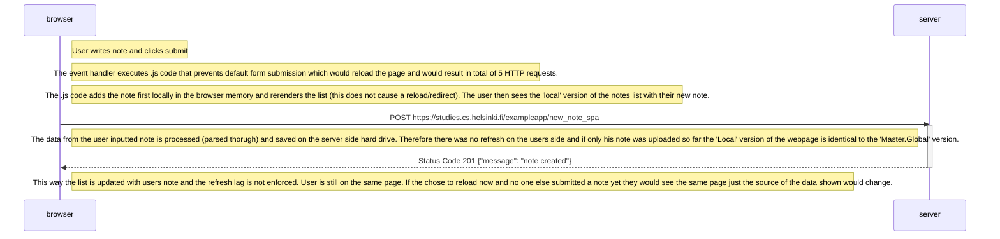

```mermaid
sequenceDiagram
    participant browser
    participant server

    Note right of browser: User writes note and clicks submit
    Note right of browser: The event handler executes .js code that prevents default form submission which would reload the page and would result in total of 5 HTTP requests.
    Note right of browser: The .js code adds the note first locally in the browser memory and rerenders the list (this does not cause a reload/redirect). The user then sees the 'local' version of the notes list with their new note.

    browser->>server: POST https://studies.cs.helsinki.fi/exampleapp/new_note_spa
    activate server

    Note left of server: The data from the user inputted note is processed (parsed thorugh) and saved on the server side hard drive. Therefore there was no refresh on the users side and if only his note was uploaded so far the 'Local' version of the webpage is identical to the 'Master.Global' version.

    server-->>browser: Status Code 201 {"message": "note created"} 
    deactivate server

    Note right of browser: This way the list is updated with users note and the refresh lag is not enforced. User is still on the same page. If the chose to reload now and no one else submitted a note yet they would see the same page just the source of the data shown would change.

```